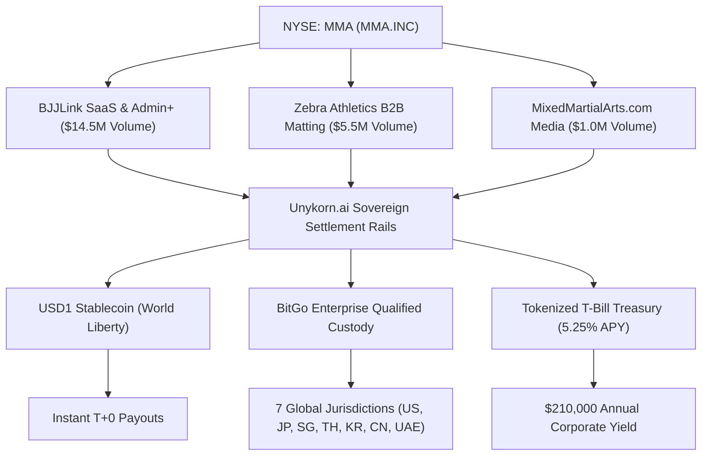

# MMA.INC x Unykorn.ai x BitGo Enterprise — Web3, Global Markets & Institutional DeFi Strategy Architecture

## Executive Summary

**Mixed Martial Arts Group Limited (NYSE American: MMA / DBA: MMA.INC)**, in technical partnership with **Unykorn.ai** and **BitGo Enterprise Custody**, orchestrates a **$21M+ annualized financial velocity network** across 15,326 combat sports academies, 680,000 active athletes, and major international fight promotions across 7 key global jurisdictions.

By replacing legacy card payment gateways with **USD1 (World Liberty Financial)** and **BitGo MPC Qualified Treasury Vaults**, MMA.INC unlocks **$661,500 in annual net fee savings**, achieves **T+0 instant settlement**, eliminates credit card chargeback risk, and generates **$210,000+ in risk-free corporate yield** via 5.25% tokenized US Treasury Bills.

---

## 1. The Global Combat Sports Macro Market

Combat sports represents a **$12.5 Billion global economy**, characterized by high transaction friction, fragmented international jurisdictions, severe credit card processor interchange markups (3.70% - 5.50%), and multi-day settlement delays for fighter purses and gym fitouts.



---

## 2. Multi-Jurisdiction Regulatory Matrix & Currency Flow

MMA.INC operates automated tax withholding and compliant purse settlement across 7 core regional fight hubs:

| Jurisdiction | Key Promotions | Regulator & Compliance Standard | Tax Withholding BPS | Local Settlement Token / Rail |
| :--- | :--- | :--- | :--- | :--- |
| **United States** | UFC, PFL, Bellator, BKFC | **SEC, CFTC, FinCEN, NSAC, CSAC** | 1000 (10.0%) | **USDC / USD1 / Wire** |
| **Japan** | RIZIN, K-1, RISE, DEEP | **JFSA, JVCEA (PSA Art. 63-11)** | 2042 (20.42% NTA Art 161) | **JPYC / BitGo MPC JPY** |
| **Singapore** | ONE Championship, MFN Asia | **MAS (Payment Services Act)** | 1500 (15.0% IRAS) | **SGD / BitGo SG MPI** |
| **Thailand** | ONE Lumpinee, RWS, Fairtex | **SAT (Boxing Act B.E. 2542), SEC** | 1500 (15.0% Form PND 53) | **THB PromptPay / BAHTNET** |
| **South Korea** | ROAD FC, Black Combat, ZFN | **FSC Korea, FIU Travel Rule** | 2200 (22.0% NTS Foreign) | **KRW / BitGo KR Rail** |
| **Greater China** | Wu Lin Feng, JCK MMA, CKF | **SFC Hong Kong (VATP License)** | 1500 (15.0% Inland Rev) | **HKD / SFC Licensed Custodian** |
| **Middle East** | PFL MENA, BRAVE CF, UFC AUH | **VARA Dubai, ADGM FSRA** | 0 (0.0% Tax Free) | **USD1 Sovereign Escrow** |

---

## 3. Web3 & Institutional DeFi Infrastructure Stack

### 3.1 USD1 Transactional Layer (World Liberty Financial)
- **1:1 USD Cash & T-Bill Backing**: Guaranteed zero-volatility settlement.
- **Interchange Reduction**: Replaces traditional 3.70% card interchange fees with a 0.40% flat rail cost (0.55% total including BitGo custody).
- **Train-to-Earn Gym Rewards**: 680,000+ athletes earn fractional USD1 micro-rebates for daily gym check-ins via BJJLink Admin+.

### 3.2 ERC-3643 Permissioned Token Engine & ERC-6551 Token Bound Accounts (TBA)
- **ERC-3643 On-Chain Compliance**: Automated KYC/AML identity verification, jurisdiction checks, and accreditation enforcement before token minting/transfer.
- **ERC-6551 Athlete XP Passports**: Each fighter's smart contract wallet acts as an autonomous account holding belt rank credentials, win/loss fight provenance, tournament metadata, and fractional NIL yield rights.

### 3.3 BitGo Enterprise Qualified Custody & Treasury Yield Engine
- **Multi-Party Computation (MPC)**: 3-of-5 threshold signature security protecting corporate liquidity across US, APAC (Singapore), and Japan vaults.
- **Automated Treasury Yield**: $4.0M in strategic capital placement deployed into tokenized short-duration US Treasury Bills, generating **$210,000/yr ($17,500/mo)** in recurring non-dilutive income.

---

## 4. Financial Velocity & Interchange Economic Breakdown

On an annualized payment volume of **$21,000,000**:

```
Traditional Credit Card Interchange:  $21,000,000 * 3.70% = $777,000 / year
Unykorn + BitGo USD1 Transaction Rail: $21,000,000 * 0.55% = $115,500 / year
-----------------------------------------------------------------------------
NET ANNUAL PROCESSOR SAVINGS:                             $661,500 / year
ANNUAL TREASURY BILL YIELD (5.25% APY):                   $210,000 / year
-----------------------------------------------------------------------------
TOTAL COMBINED VALUE UNLOCKED:                            $871,500 / year
```

---

## 5. Strategic Roadmap & Expansion Schedule

- **Q4 2025**: Finalize BJJLink Admin+ rollout across all new UFC GYM BJJ franchise studios.
- **Q1 2026**: Expand BitGo Japan JPYC settlement gateway for Saitama Super Arena & Tokyo Dome international bout purses.
- **Q2 2026**: Launch Decentralized Prediction Markets & Real-Time Biometric Fight Telemetry Oracles.
- **Q3 2026**: Complete full cross-border RWA Zebra matting PO escrow integration for 500+ Asian martial arts academies.
