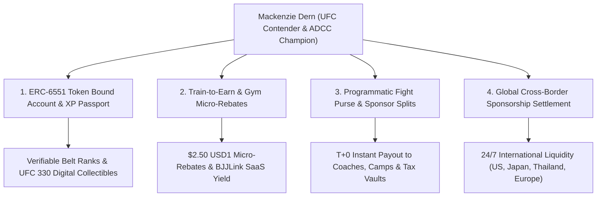

# Flagship Case Study: Mackenzie Dern & Tokenized Athlete Infrastructure

## Overview

As a **world champion grappler (ADCC Gold Medalist, 3x BJJ World Champion)**, a gym-affiliated master trainer, and a premier global sports icon, **Mackenzie Dern** demonstrates how elite combat sports athletes capture, retain, and scale the value they generate using **Unykorn.ai Web3 Rails**, **BitGo Enterprise Custody**, and **USD1 Stablecoins**.

---

## The Four Web3 Infrastructure Pillars for Mackenzie Dern

---

### 1. Token-Bound Accounts & On-Chain XP Passports

* **Verifiable Career Registry:** Through an on-chain digital passport via **ERC-6551 Token Bound Accounts**, Mackenzie’s credentials—ADCC Gold Medals, IBJJF Black Belt rank, 3x World Championship titles, and official UFC bout outcomes—are anchored directly to her self-sovereign smart contract wallet (`0x4E574939D460d284B5D990646D4aeaEF2D49Fa13`).
* **Direct Fan Engagement & Collectibles:** Direct issuance of verifiable digital collectibles (such as commemorative badges or virtual memorabilia from historic title defenses like **UFC 330**) straight to her core global fan base with zero intermediary platform cuts.

---

### 2. Instant Micro-Rebates & Train-to-Earn Integration

* **Monetizing the Gym Ecosystem:** Training, coaching, and sparring in academies worldwide automatically triggers **Train-to-Earn** mechanics. Check-ins and seminars at affiliated UFC GYM BJJ studios trigger automated **$2.50 USD1 stablecoin micro-rebates** and 50 XP points per session.
* **Passive Academy Value:** Integrating Unykorn payment rails eliminates credit card interchange drag (slashing fee drag down from ~3.7% to 0.55%), boosting profitability across affiliated martial arts academies.

---

### 3. Automated, Frictionless Fight Purse & Sponsor Splits

* **Instant T+0 Settlement:** Traditional fight purse disbursements, manager cuts, coach percentages, and cross-border tax withholdings often involve multi-week delays.
* **Smart Contract Splitting:** Using Unykorn programmatic purse rails, bout payouts are instantly split down to the exact percentage the moment a fight concludes:
  - **70%**: Net Athlete Payout to BitGo MPC Vault (`0x4E57...Fa13`).
  - **10%**: Head Coach & RVCA / Parillo Training Camp Split.
  - **10%**: Athlete Management.
  - **10%**: Compliant Nevada State Athletic Commission / IRS Tax Vault.

---

### 4. Direct Global Sponsorships & Cross-Border Rails

* **Instant Global Payouts:** With a global fan base spanning North America, Brazil, Japan, Thailand, and Europe, stablecoin rails allow international brands, sponsors, and digital product sales to settle instantly with 24/7 liquidity, bypassing traditional correspondent banking delays, high wire fees, and FX losses.
